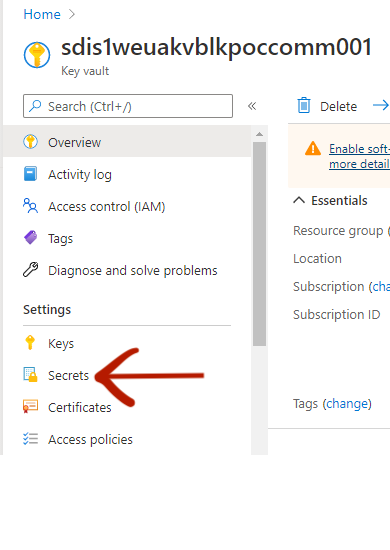
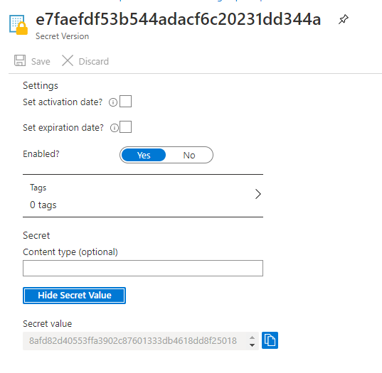
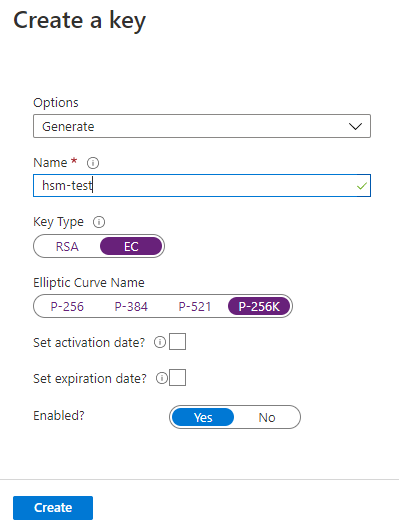
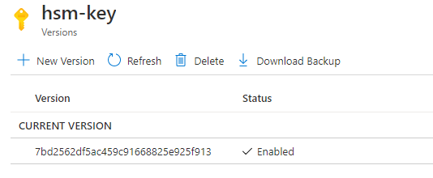

## Information about the testing environment.
### Accounts
- Acount1: "0x71217b5145aad63387673A39a717e5d2aABD6c5B"
- Key1 name on AKV: "santander"
- Acount2: "0xa38D7EE6Ea7Ba8503Bb9A51a15e959371eEedFa2"
- Key2 name on AKV: "bankia"
- Acount3: "0x8B7aa6dCefFCb2917Bc18609a8E1E650F038980A"
- Key3 name on AKV: "bbva"
- Acount3: "0x145dc3442412EdC113b01b63e14e85BA99926830"
- Key4 name on AKV: "hsm-key"

### Endpoints
- 52.157.68.69:8545  //  30352bed...14cc7e7f
- 40.68.120.93:8545  //  31134712...1be131dc
- 13.80.45.53:8545  // 104e566b...153accbd
- 52.166.19.166:8545  //  47fdb222...b2f649fe
- 51.124.166.42:8545  //  38d4468c...3ff5a17d	
- 13.95.104.31:8545  //  4c74f76e...2f0b8d20
- 52.232.16.182:8545  //  2f2b921f...9b408aa5


## How to prepare an AKV instance for the demo.
### Bring up an instance of Azure key vault
First you need to create an Azure Key Vault on your resource group, it doesn't need to have any special featurejust follow the steps on the wizard to have it ready.

### Create a service principal(in case is not created)
Here at Santander if you ask for a resource group with an Azure Key Vault inside  you should already have a default service principal created already for that resource group.

If that is not the case you need to create a new one with the following command from the azure CLI.
```
az ad sp create-for-rbac --name http://my-application --skip-assignment
```
That command should return the following json:
```
{
    "appId": "generated app id",
    "displayName": "my-application",
    "name": "http://my-application",
    "password": "random password",
    "tenant": "tenant id"
}
```
In this json we have to take 3 of these values and set their values on the "config.py" file.
```
CLIENT_ID = <appId>
PASSWORD = <password>
TENANT_ID = <tenant>
```

### Retrieve service principal for configuration
In case you have created yourself the service principal you don't need to execute this step, because what we will do is to retrieve the info is to retrieve the same info that you get on the json while creating the service principal.

First you need to enter the Secrets tab from the AKV



Copy the name the name of that secret, the display-name of your service principal.


Now execute the following command with that display-name.
```
az ad sp list --display-name <name>
```

You will get a very long json from which the information we need is at the very begining.
```
[
  {
    "accountEnabled": "True",
    "addIns": [],
    "alternativeNames": [],
    "appDisplayName": "sdis1glbsp3blkpocauth001",
    "appId": "07e9b304-3036-46bb-af24-1eac6124fb48",
    "appOwnerTenantId": "35595a02-4d6d-44ac-99e1-f9ab4cd872db",
    "appRoleAssignmentRequired": false,
    "appRoles": [],
    ...
  }
]
```
You can set now 2 of the variables from the config.py file with the "appOwnerTenantId" and "appId".
```
CLIENT_ID = <appId>
TENANT_ID = <appOwnerTenantId>
```
After this you need to access again the secrets tab and click on the name of the secret that you copied before, to acces the info for that service pricipal.
You will get a view like this.



Just click on the button "Show secret" and copy the information in "Secret value". This value is the password that you need to configure on the config.py.

```
PASSWORD = <secret-value>
```

### Create the key inside AKV to be compatible with Ethereum
To create the key we will use on the demo you just need to enter the "Keys" tab inside the AKV. And there click on the Generate/Import button that is on top

Once on the creation of the key make sure to select EC to make it an Elliptic Curve key and set the Elliptic Curve Name to "P-256K" as you can see on the image because that is the name Azure has given to the curve Secp256k1 that is the one used on Ethereum.



Enter again on Keys tab from your AKV and click on the key you have just created to see its info.



There you have the version id that you need to paste on the config file.

```
KEY_VERSION = <version-id>
```


